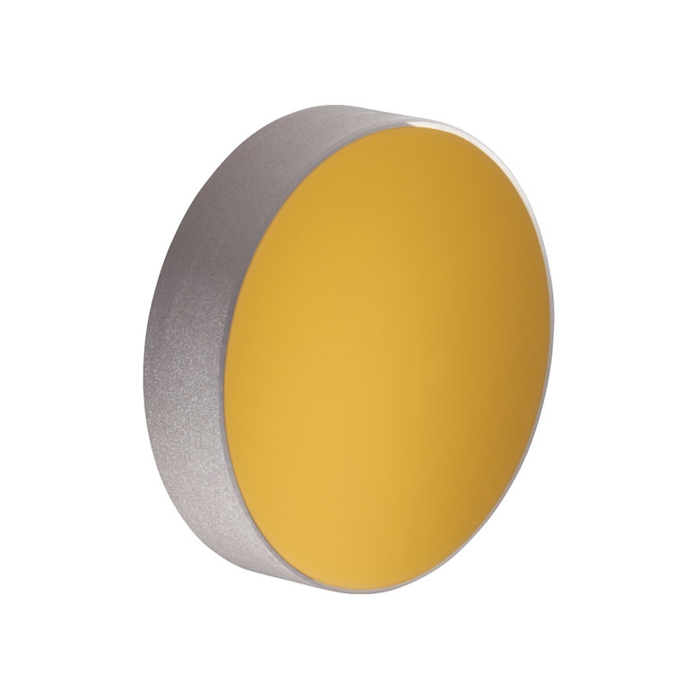

 

 

  
  <h1 align="center">Wave-transfer matrix for multilayer optics</h1>
    

Wave-transfer matrix and scattering matrix toolbox. 
Can be used for simple calculation of  wave-transfer matrix or scattering 
matrix of multilayer optical system. Scattering matrix can be converted to 
transmittance and reflectance very simply.
  

## Usage
See the [example](example.m) .

## License
Distributed under the MIT License. See [`LICENSE`](LICENSE) for more information.

## Contact
Project Link: [alekseikukin/wtmmo](https://github.com/alekseikukin/wtmmo).